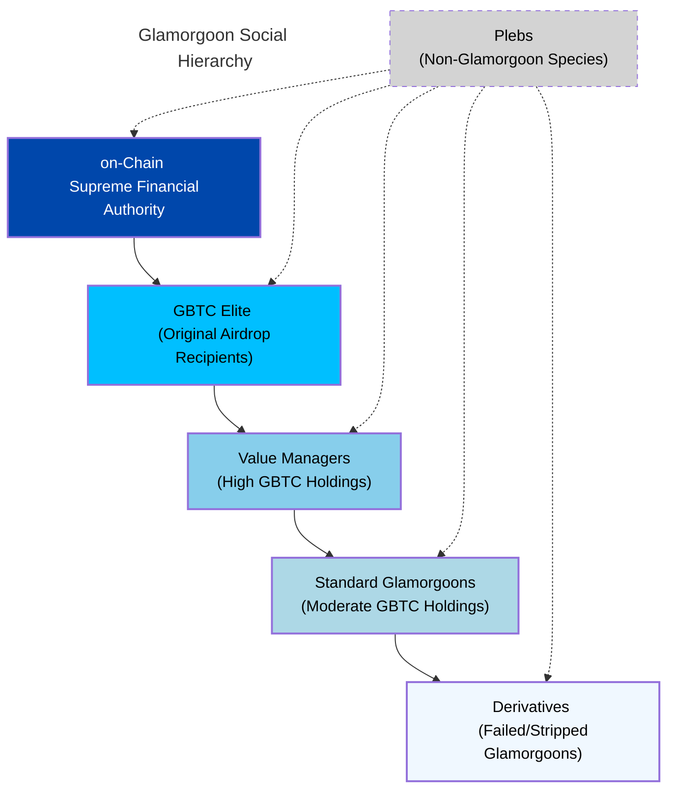
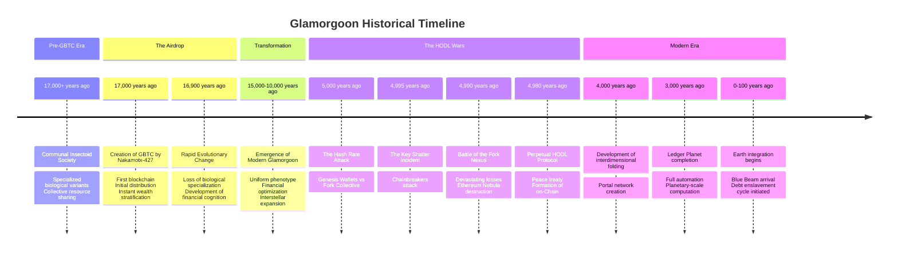
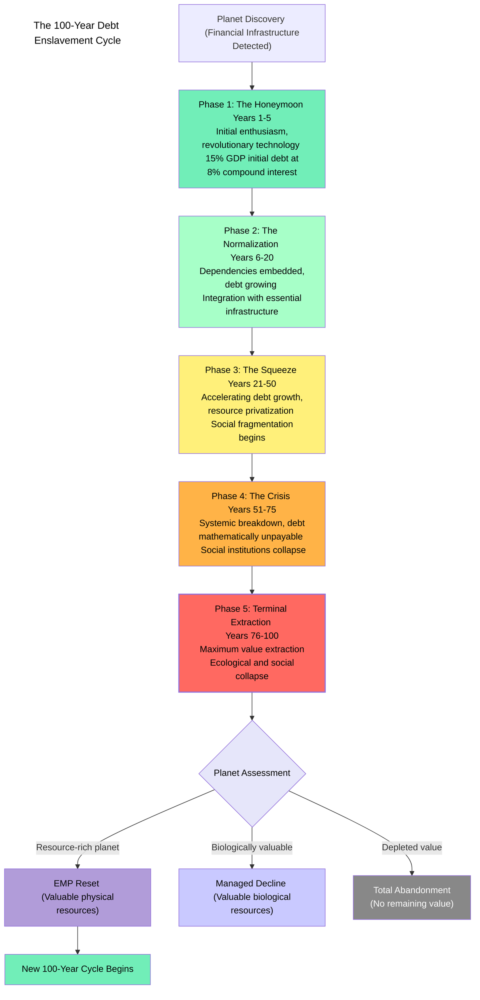
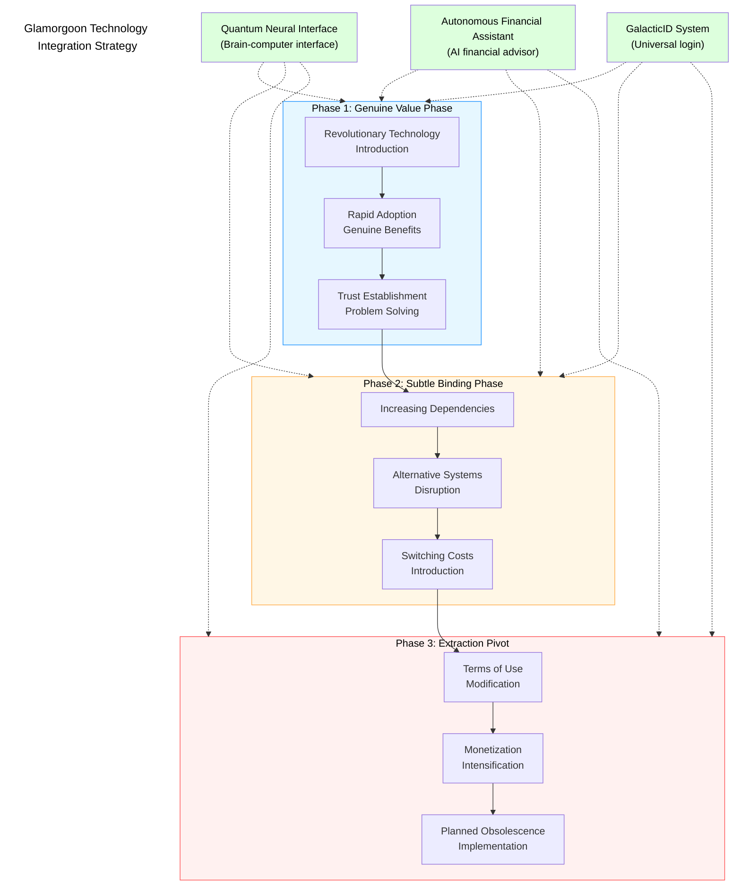

# Glamorgoon Universe Visualizations

## Glamorgoon Hierarchical Structure



## Historical Timeline of Glamorgoon Civilization



## The 100-Year Debt Cycle



## Technology Integration System



## Earth Integration Process

```mermaid
graph TB
    title["Earth's Integration into Glamorgoon Financial System"]
    
    subgraph CurrentStage["Current Stage: Initial Integration (Years 1-5)"]
        arrival["Blue Beam Arrival<br>Patrick Bateman avatars"]
        marketing["Crypto/NFT Marketing<br>Exploiting existing meme culture"]
        early["Early Adopter Incentives<br>Creating human proxies"]
        tech["Initial Technology Introduction<br>QNI & AFA systems"]
    end
    
    subgraph FutureStages["Projected Future Stages"]
        stage2["Normalization<br>Years 6-20"]
        stage3["The Squeeze<br>Years 21-50"]
        stage4["The Crisis<br>Years 51-75"]
        stage5["Terminal Extraction<br>Years 76-100"]
    end
    
    arrival --> marketing --> early --> tech
    tech --> stage2 --> stage3 --> stage4 --> stage5
    
    %% Integration strategies
    ignorance["Ignorance Maintenance<br>Systems"]
    ignorance ---> arrival & marketing & early & tech
    
    justification["Protection Racket<br>Phantom threats"]
    justification ---> stage2 & stage3
    
    debt["8% Compound Interest<br>CIL debt structure"]
    debt ---> stage2 & stage3 & stage4 & stage5
    
    resistance["Resistance Management<br>Strategic responses"]
    resistance ---> stage3 & stage4 & stage5
    
    style title fill:none,stroke:none,color:black
    style CurrentStage fill:#E6F7FF,color:black,stroke:#1890FF,stroke-width:2px
    style FutureStages fill:#F9F0FF,color:black,stroke:#722ED1
    
    style ignorance fill:#FFF7E6,color:black,stroke:#FFA940
    style justification fill:#FFF7E6,color:black,stroke:#FFA940
    style debt fill:#FFF7E6,color:black,stroke:#FFA940
    style resistance fill:#FFF7E6,color:black,stroke:#FFA940
    
    classDef title font-size:18px,fill:none,stroke:none;
    class title title;
